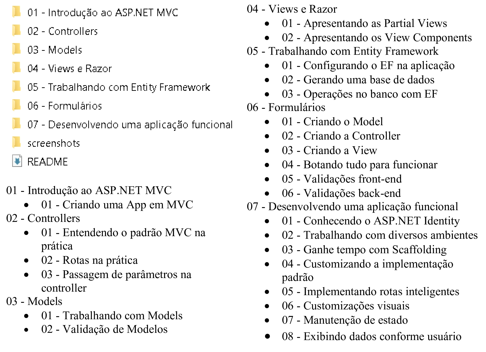

# Fundamentos do ASP.NET MVC

## 📝️ Escopo do Projeto

<p align="justify">
O projeto oferece uma visão abrangente dos fundamentos do ASP.NET MVC, abordando os seguintes tópicos: 
introdução, controllers, models, views e Razor, Entity Framework, formulários e a implementação de uma 
aplicação funcional
</p>

## 🛠️ Construído com

* [Visual Studio 2022](https://learn.microsoft.com/pt-br/visualstudio/windows/?view=vs-2022) - Ferramenta de desenvolvimento, que permite realizar todo o ciclo de desenvolvimento em um só lugar.
  
## 📚 Principais Bibliotecas, Frameworks e Comandos do NuGet Utilizados

* [net7.0](https://learn.microsoft.com/pt-br/dotnet/core/compatibility/7.0) - Versão da plataforma de desenvolvimento .NET, que é de código aberto e multiplataforma, desenvolvida pela Microsoft.

```
dotnet add package Microsoft.NET.Sdk.Web --version 7.0.0
```

* [Microsoft.EntityFrameworkCore](https://learn.microsoft.com/pt-br/ef/core/get-started/overview/install) - 
ORM que permite a interação entre aplicativos .NET e bancos de dados relacionais de maneira eficiente e prática.

```
NuGet\Install-Package Microsoft.EntityFrameworkCore -Version 7.0.9
```

* [Microsoft.AspNetCore.Identity.EntityFrameworkCore](https://learn.microsoft.com/pt-br/dotnet/api/microsoft.aspnetcore.identity.entityframeworkcore.identityuser?view=aspnetcore-1.1) - 
Pacote do .NET que oferece uma implementação do ASP.NET Core Identity usando o Entity Framework Core (EF Core) para armazenamento e gerenciamento de dados relacionados à identidade e autenticação de usuários. 

```
NuGet\Install-Package Microsoft.AspNetCore.Identity.EntityFrameworkCore -Version 7.0.8
```

* [Microsoft.AspNetCore.Identity.UI](https://learn.microsoft.com/pt-br/dotnet/api/microsoft.aspnetcore.identity.ui?view=aspnetcore-9.0) - 
Pacote que fornece interfaces de usuário (UI) prontas para serem usadas, que ajudam a implementar funcionalidades relacionadas à identidade, como o registro de usuários, login, redefinição de senha e gerenciamento de perfil.

```
NuGet\Install-Package Microsoft.AspNetCore.Identity.UI -Version 7.0.8
```

## 🚧 Descrição da Estrutura do Projeto

A estrutura do projeto segundo a imagem abaixo é composta da seguinte forma:



## ⚠️ Atenção

Destinado exclusivamente para fins de estudo.

---
⌨️ por [Byron Doria](https://gist.github.com/lohhans) 😊
